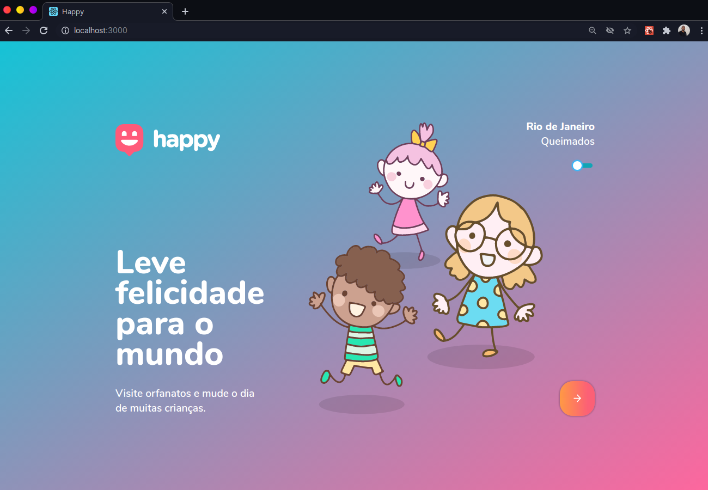
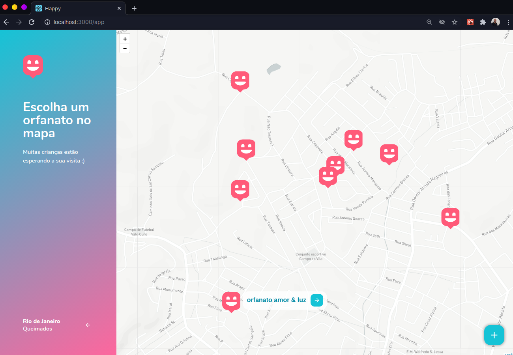

<h1 align="center">Happy</h1>

<p align="center">
  

  <a href="https://www.linkedin.com/in/helitonoliveira/">
    
  </a>

  

  <a href="https://github.com/heliton1988/happy/stargazers">
    
  </a>
</p>

<p align="center">
  <a href="#memo-sobre">Sobre</a>&nbsp;&nbsp;&nbsp;|&nbsp;&nbsp;&nbsp;
  <a href="#wrench-ferramentas-utilizadas">Ferramentas</a>&nbsp;&nbsp;&nbsp;|&nbsp;&nbsp;&nbsp;
  <a href="#arrowdown-como-clonar-o-projeto">Baixe o projeto</a>&nbsp;&nbsp;&nbsp;|&nbsp;&nbsp;&nbsp;
  <a href="#pagefacingup-licença">Licença</a>
</p>

<p align="center">
  
</p>

<p align="center">
  
</p>

## :memo: Sobre

Happy é uma aplicação que estou desenvolvendo no evento `NLW(Next Level week)` oferecido pela [Rocketseat](https://rocketseat.com.br/). Ao final do treinamente terei desenvolvido uma aplicação completa que envolve front-end web, mobile & back-end.<br />

O nome `happy` não foi escolhido por acaso, pois outubro é o mês das crianças, então em homenagem a isso essa aplicação tem uma pegada social com foco nos pequeninos.

Ficou curioso...? quer aprender programação ou se já programa quer ir além de onde você já está, ainda da tempo, você pode se escrever no treinamento acessando o link: [Clique em mim!](https://nextlevelweek.com/inscricao/3)

## :wrench: Ferramentas utilizadas

- [ReactJS](https://pt-br.reactjs.org/)
- [React-Router-Dom](https://reactrouter.com/web/guides/quick-start)
- [TypeScript](https://www.typescriptlang.org/)
- [React-Icons](https://react-icons.github.io/react-icons/)
- [CSS](https://developer.mozilla.org/pt-BR/docs/Web/CSS)
- [Leaflet](https://leafletjs.com/examples/quick-start/)
- [React Leafleft](https://react-leaflet.js.org/docs/en/context)
- [MapBox](https://www.mapbox.com/)
- [EditorConfig](https://editorconfig.org/)
- [ESlint](https://eslint.org/)

## ## :arrow_down: Como clonar o projeto

⚠ **Obsevaçoes**<br />
é necessário ter as seguinter ferramentas instaladas em sua maquina:
- Node.js
- yarn / npm

para que o mapa caregue normalmente acesse o [MapBox](https://github.com/heliton1988/happy.git), crie uma conta, gere uma key única. Feito isso crie um arquivo `.env` na raiz do projeto e siga os passos abaixo: :arrow_down:

```env
  REACT_APP_MAPBOX_TOKEN=coloque sua key aqui
```

baixando o projeto;

```bash
# Clone o projeto em sua maquina;
$ git clone https://github.com/heliton1988/happy.git

# Acesse a pasta do projeto;
$ cd web

# Instale todas as dependências;
$ yarn / npm install

# Rode o projeto;
$ yarn / npm run start

```


## :page_facing_up: Licença

Esse projeto está sob a licença MIT. Veja o arquivo [LICENSE](https://github.com/heliton1988/happy/blob/master/LICENSEE) para mais detalhes.

<br /><br />

<p align="center">Feito com 💛 by <a href="https://www.linkedin.com/in/helitonoliveira/" target="_blank">Héliton Oliveira</a></p>