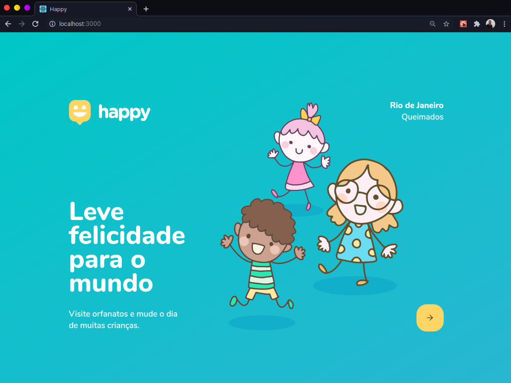

<h1 align="center">Happy</h1>

  

  

  

  

<h2 align="center">
  
</h2>

## :memo: Sobre

Happy é uma aplicação que estou desenvolvendo no evento `NLW(Next Level week)` oferecido pela [Rocketseat](https://rocketseat.com.br/). Ao final do treinamente terei desenvolvido uma aplicação completa que envolve front-end web, mobile & back-end. 

O nome `happy` não foi escolhido por acaso, pois outubro é o mês das crianças, então em homenagem a isso essa aplicação tem uma pegada social com foco nos pequeninos.

Ficou curioso...? quer aprender programação ou se já programa quer ir além de onde você já está, ainda da tempo, você pode se escrever no treinamento acessando o link: [Clique em mim!](https://nextlevelweek.com/inscricao/3)
